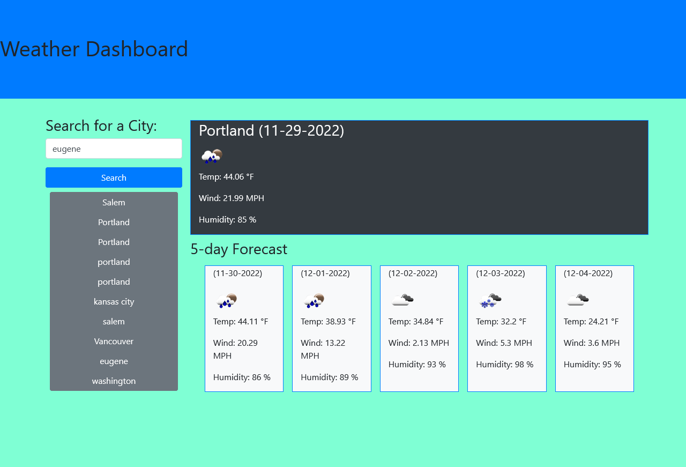

# w6-Weather-Dashboard-SN927N38-2h
## Description
This project is an exercise in web API's. Specifically, this utilizes weather information to display the current conditions at a user-entered city.
## Installation
n/a
## Usage
Enter a city name and the website will display the current weather as well as a five-day forecast. The website saves your searches as a history.
https://baldurthebuilder.github.io/w6-Weather-Dashboard-SN927N38-2h/

## License
Please see the license in the repo.
---
